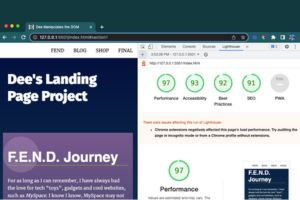

# :framed_picture: Landing Page Project

## Table of Contents

* [Project_Description](#memo-project-description)
* [How_to_Install_and_Run](#electric_plug-how-to-install-and-run)
* [How_to_Use_Project](#computer-how-to-use-project)
* [Credits](#family_man_woman_girl_boy-credits)
* [How_to_Contribute](#pen-how-to-contribute)
* [Resources](#books-resources)
* [Lighthouse_Report](#bulb-house-lighthouse-report)
* [License](#ballot_box_with_check-license)

## :memo: Project Description

This originated from a starter project with some HTML and CSS styling which displayed a static version of the Landing Page project. This project was converted from a static project to an interactive one to satisfy requirements for Udacity Front End Web Development Nano Degree Program.

## :electric_plug: How to Install and Run

No installation necessary. View in your browser.

## :computer: How to Use Project

View in your browser and read the text on the screen.  Utilize a screen reading app to have the text read to you.

## :family_man_woman_girl_boy: Credits

Myself, Deltrece Daniels, along with Udacity session leaders and peers. 

## :pen: How to Contribute

Fork this project and create your own landing page.

## :books: Resources

Udacity classroom module, library books and their access to online learning academys.  YouTube videos, Session Leads and Self-Initiated Peer Study Sessions.

## :bulb: :house: Lighthouse Report
Accesibility Results: 

## :ballot_box_with_check: License

[License](LICENSE.txt)

[(Back to top)](#table-of-contents)
